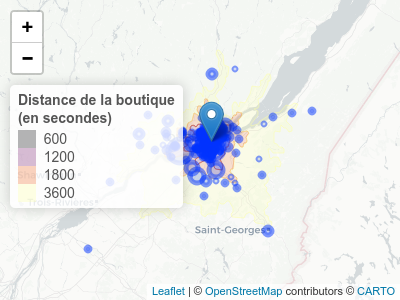
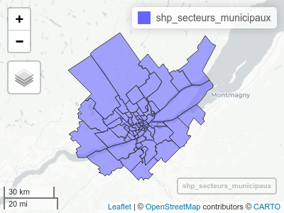
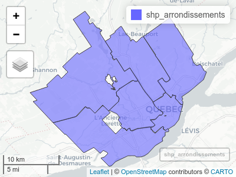

<!-- README.md is generated from README.Rmd. Please edit that file -->

# renojouet

<!-- badges: start -->
<!-- badges: end -->

The goal of renojouet is to …

## Installation

You can install the released version of renojouet from github

``` r
devtools::install_github("SimonCoulombe/renojouet")
```

## Data

The main data of this package are the `clients` and `donateurs`
(donators) tibbles. They respectively contain the code\_postal (postal
codes) of 1022 clients and 191 donators to a non-profit toy store in
Quebec city, Réno-Jouets.

Some additional ground work has been done to make the data easier to
use:  
- `renojouet_adresse` is a text string of the store’s address (“2699
Avenue Watt, Québec, QC G1P 3X3”),  
- `renojouet_location` is a sf data.frame with the store location as a
point, geocoded using hereR geocoding api (-71.30531 46.78629),  
- `geocoded_code_postal` is tibble of all the the postal codes, with the
latitude/longitude available possible (geocoded using google maps api).
- `sf_clients` contains the `clients` left\_joined to
`geocoded_code_postal`,  
- `sf_donateurs` contains the `donateurs` left\_joined to
`geocoded_code_postal`,  
- `shp_arrondissements` is an sf data.frame containing the shapefile of
the 6 arrondissements (neighbourhoods) in Quebec City,  
- `shp_secteurs_municipaux` is an sf data.frame containing the shapefile
of the 69 areas defined in a transportation study in 2017. It has areas
from Quebec city and neighbouring cities  
- `isolines`is an sf data.frame containing the shapefile showing the
driving times from the store (600 seconds, 1200 seconds, 1800 seconds
and 3600 seconds)

Some ideas: look at the characeteristics of the neighborhoods of the
clients vs general population using the {cancensus} package.

``` r
library(renojouet)
library(mapview)
library(leaflet)
library(tidyverse)
#> ── Attaching packages ─────────────────────────────────────── tidyverse 1.3.0 ──
#> ✓ ggplot2 3.3.2     ✓ purrr   0.3.4
#> ✓ tibble  3.0.4     ✓ dplyr   1.0.2
#> ✓ tidyr   1.1.2     ✓ stringr 1.4.0
#> ✓ readr   1.4.0     ✓ forcats 0.5.0
#> ── Conflicts ────────────────────────────────────────── tidyverse_conflicts() ──
#> x dplyr::filter() masks stats::filter()
#> x dplyr::lag()    masks stats::lag()
## basic example code
```

``` r
knitr::kable(clients %>% head(5))
```

| timestamp                  | categorie                                                   | code\_postal | premiere\_visite | comment\_avez\_vous\_entendu\_parler\_de\_nous            |
|:---------------------------|:------------------------------------------------------------|:-------------|:-----------------|:----------------------------------------------------------|
| 2020/10/06 12:39:32 PM EST | Corporatif (enseignants, service-de-garde, garderies, etc.) | G7A4S2       | Non              | Famille et amis                                           |
| 2020/10/06 12:45:53 PM EST | Parents avec jeunes enfants                                 | G2E4E8       | Non              | Famille et amis                                           |
| 2020/10/06 1:43:03 PM EST  | Parents avec jeunes enfants                                 | G1G1A6       | Non              | Famille et amis                                           |
| 2020/10/06 2:24:04 PM EST  | Parents avec jeunes enfants                                 | G3L2J6       | Oui              | Famille et amis                                           |
| 2020/10/06 2:30:08 PM EST  | Parents avec jeunes enfants                                 | G1X2N1       | Oui              | Événements (Conteneur de l’amour, parade des jouets, etc) |

``` r
knitr::kable(donateurs %>% head(5))
```

| code\_postal |
|:-------------|
| GZC0H6       |
| G1L3Z3       |
| G3B1M3       |
| G6K1N2       |
| G2E5V1       |

``` r
factpal <- colorFactor(palette = "inferno", domain = isolines$range)

poly_map <- leaflet() %>% 
  addProviderTiles("CartoDB.Positron", group="Greyscale") %>% 
  addPolygons(data = isolines , weight = 1, col = ~factpal(range), stroke = TRUE) %>% 
  addMarkers(data = renojouet_location, popup = "Magasin Réno-Jouets") %>% 
  addLegend("topleft", data= isolines, pal = factpal, values = ~range,
            title = "Distance de la boutique<br>(en secondes)",
            opacity = 0.3) %>%
  addCircleMarkers(data = sf_clients %>% count(code_postal),
                   radius = ~ n,
                   popup = ~ paste0(code_postal, " - ", n, " visites"))


poly_map
```



``` r
mapview(shp_secteurs_municipaux)
```



``` r
mapview(shp_arrondissements)
```


